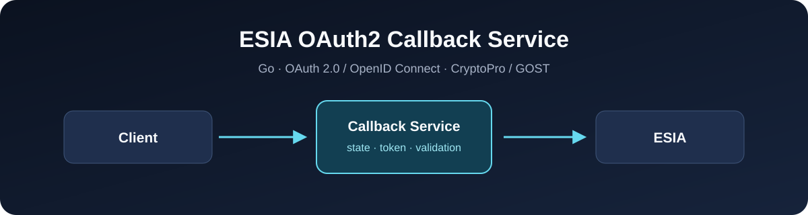
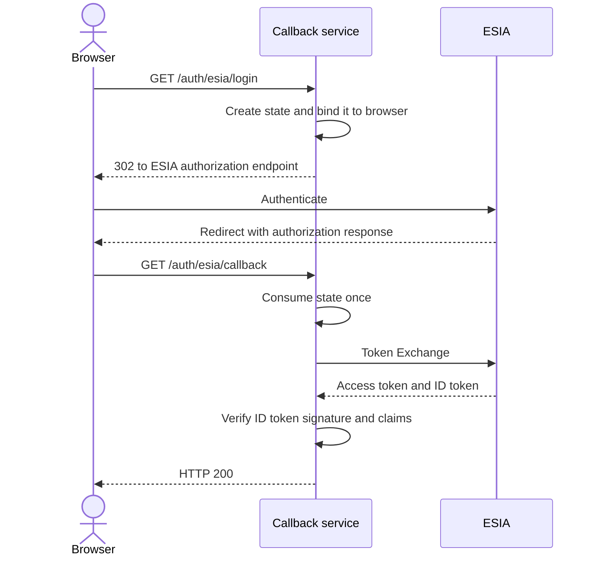

# ESIA OAuth2 Callback Service

Go-сервис для серверной OAuth 2.0 / OpenID Connect интеграции с ЕСИА с
использованием CryptoPro CSP и ГОСТ-подписи.

[](https://go.dev/)
[](https://github.com/AlchemistBro/esia/actions/workflows/ci.yml)
[](https://github.com/AlchemistBro/esia/issues)



> Независимый пример интеграции. Проект не является официальным продуктом
> ЕСИА, Минцифры России или CryptoPro.

## Возможности

- формирование и подпись OAuth 2.0 authorization request;
- серверное хранение `state`, TTL и однократное использование;
- привязка `state` к браузеру через защищённую cookie;
- Token Exchange без передачи токенов браузеру;
- проверка ID token: ГОСТ 2012 или RSA, `alg`, `typ`, `sbt=id`,
  `iss`, `aud`, `sub`, `exp`, `nbf` и `iat`;
- узкий fail-closed workaround для `permissions=nil` в
  `go-api-epgu v0.5.0`;
- запуск в Docker за совместимым с nginx reverse proxy.

## Как работает авторизация



Сервис создаёт авторизационную транзакцию и связывает её с браузером.
После callback он однократно поглощает `state`, обменивает authorization
code на токены и локально проверяет ID token. Токены в ответ браузеру не
передаются. Подробности: [архитектура](./docs/ru/architecture.md).

## Установка

### Требования

- Linux;
- Go 1.25.14 или более новая совместимая версия;
- CryptoPro CSP;
- зарегистрированная тестовая ИС ЕСИА;
- клиентский сертификат и соответствующий private key container;
- публичный сертификат TESIA;
- Docker и Docker Compose — только для контейнерного запуска.

CryptoPro packages, key containers, PIN и сертификаты в репозиторий не входят.

### Клонирование

```bash
git clone <your-repository-url>
cd esia
```

## Конфигурация

```bash
cp config.example.json config.json
```

| Поле | Назначение |
|---|---|
| `redirect_uri` | Зарегистрированный callback URL |
| `mnemonic` | Мнемоника информационной системы ЕСИА |
| `esia_uri` | Базовый URL нужного контура ЕСИА |
| `csp_test_path` | Путь к `csptest` или совместимой обёртке |
| `csp_container` | Идентификатор клиентского key container |
| `cert_hash` | Отпечаток клиентского сертификата |
| `http_listen_addr` | Внутренний адрес HTTP listener |
| `esia_response_cert_path` | Путь к публичному сертификату TESIA |
| `id_token_algorithm` | Ожидаемый алгоритм подписи ID token |
| `id_token_issuer` | Точное ожидаемое значение `iss` |

> `config.json` намеренно исключён из Git. Даже если отдельное поле не
> является секретом, реальную production-конфигурацию публиковать не следует.

Подробное описание: [конфигурация](./docs/ru/configuration.md).

## Запуск локально

CryptoPro CSP, клиентский key container и сертификаты должны быть подготовлены
до запуска.

```bash
go run . -config ./config.json
```

Первый endpoint пользовательского flow:
`GET /auth/esia/login`.

## Запуск через Docker

Поместите лицензированные CryptoPro `.deb` packages в локальный каталог
`deploy/cryptopro/`, затем выполните:

```bash
docker compose -f compose.example.yaml build
docker compose -f compose.example.yaml up -d
```

Compose-пример использует только `expose: 8000`: host port намеренно не
публикуется. Детали и nginx-пример:
[deployment](./docs/ru/deployment.md).

## Проверка

```bash
test -z "$(gofmt -l *.go)"
go test ./...
go test -race ./...
go vet ./...
go build ./...
```

Для ручной проверки откройте через настроенный HTTPS reverse proxy
`/auth/esia/login`. Успешный callback возвращает HTTP 200 и текстовое
подтверждение завершения авторизации.

## Документация

[Русская документация](./docs/ru/index.md)

## Структура проекта

```text
.
├── main.go                 # HTTP endpoints, OAuth flow and state store
├── config.go               # Configuration loading and validation
├── id_token.go             # ID token parsing and verification
├── *_test.go               # Unit and security-relevant negative tests
├── go.mod / go.sum         # Go module and pinned dependencies
├── Dockerfile              # Runtime image with CryptoPro packages
├── compose.example.yaml    # Reverse-proxy-oriented deployment example
├── config.example.json     # Safe configuration template
├── docs/                   # Russian documentation and local assets
└── .github/workflows/      # Reproducible CI checks
```

## Зависимости

- `github.com/ofstudio/go-api-epgu v0.5.0` — закреплена намеренно;
- CryptoPro CSP — внешняя runtime-зависимость для ГОСТ-операций;
- CA certificates — доверие к HTTPS endpoints;
- Docker — только для container deployment.

## Безопасность

Никогда не добавляйте в Git private key containers, CSP PIN/password,
production config, OAuth code/state/tokens, cookies или реальные HAR-файлы.
См. [политику безопасности](./SECURITY.md) и
[модель угроз](./docs/ru/security.md).

## Ограничения

- `state` хранится в памяти и рассчитан на один instance;
- restart сбрасывает незавершённые login transactions;
- несколько replicas требуют общего атомарного state store;
- TLS завершается на внешнем reverse proxy;
- создание application session не входит в текущий сервис.

## Поддержка

Для воспроизводимой ошибки создайте
[Issue](https://github.com/AlchemistBro/esia/issues). Уязвимости следует
сообщать приватно по инструкции в [SECURITY.md](./SECURITY.md).

## Правила коммитов

| Type | Purpose |
|---|---|
| `build` | Сборка и зависимости |
| `sec` | Изменение безопасности |
| `ci` | CI-конфигурация |
| `docs` | Документация |
| `feat` | Новая функциональность |
| `fix` | Исправление ошибки |
| `perf` | Производительность |
| `refactor` | Внутреннее изменение без смены поведения |
| `revert` | Откат изменения |
| `style` | Форматирование |
| `test` | Тесты |

Subject должен быть коротким, описывать одно изменение и использовать
imperative style, например: `docs: document CryptoPro setup`.

## Лицензия

Лицензия проекта пока не определена и требует решения владельца репозитория.
