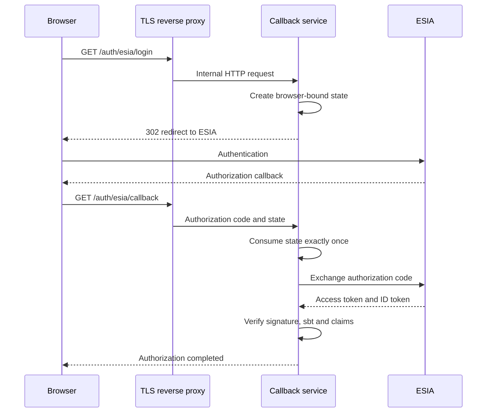

# ESIA OAuth 2.0 Callback Service

A compact Go service implementing the server side of an ESIA OpenID Connect
authorization flow with CryptoPro-backed GOST signatures.

> Independent integration example. This repository is not an official ESIA
> or CryptoPro product.

## Highlights

- OAuth authorization request signing through local CryptoPro;
- browser-bound, single-use `state` with a strict expiration time;
- `Secure`, `HttpOnly`, `SameSite=Lax` pre-auth cookies;
- authorization-code exchange without exposing tokens to the browser;
- GOST 2012 and RSA ID token signature verification;
- strict checks for `alg`, `typ`, `sbt == "id"`, `iss`, `aud`, `sub`, `exp`,
  `nbf` and `iat`;
- bounded HTTP timeouts and graceful shutdown;
- hardened container baseline with no published application port;
- race-tested, hermetic unit tests and automated vulnerability checks.

## Authorization flow



## Development

Go 1.25.14 or a newer security-patched toolchain is required.

```bash
make check
make vuln
```

Tests use fakes and temporary files. They do not require a real ESIA account,
CryptoPro installation or production configuration.

## Configuration

```bash
cp config.example.json config.json
chmod 600 config.json
```

Replace every placeholder locally. Never commit production URLs, mnemonic,
certificate hashes, PINs, key containers, authorization codes or tokens.

## Container build

The runtime image requires licensed CryptoPro Linux packages. Put the required
`.deb` files in `deploy/cryptopro/`; Git deliberately ignores them.

```bash
docker build -t esia-callback:local .
```

Use `compose.example.yaml` as a deployment outline. Keep the application port
private and expose only a TLS reverse proxy.

## Operational model

OAuth state is stored in memory and is intended for a single application
replica. Multi-replica deployments require a shared atomic state store.

The application validates ID tokens locally and never sends access or ID
tokens to the browser. CryptoPro packages, key containers and certificates are
deployment inputs and are not repository assets.

See [SECURITY.md](SECURITY.md) for reporting guidance.
