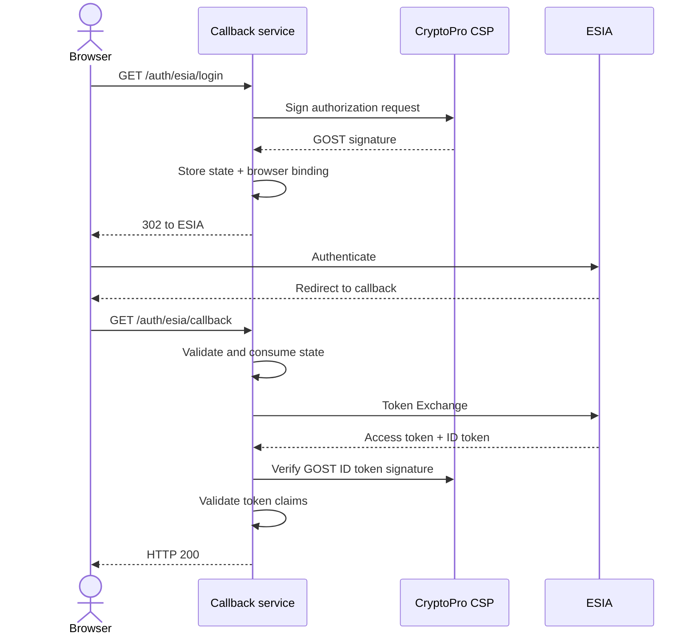

# Архитектура

> [К оглавлению](./index.md)

Сервис предоставляет два HTTP endpoint и хранит незавершённые
авторизационные транзакции в памяти одного процесса.

## Последовательность

## `GET /auth/esia/login`

Сервис получает или создаёт случайный browser identifier, формирует
authorization request через `go-api-epgu` и CryptoPro, извлекает созданный
`state` и сохраняет его с TTL 10 минут. Browser identifier записывается в
cookie `__Host-esia_pre_auth` с атрибутами `Secure`, `HttpOnly` и
`SameSite=Lax`. Затем браузер получает HTTP 302 на authorization endpoint
ЕСИА.

Перед redirect функция `withoutNilPermissions` удаляет только точное значение
`permissions=bnVsbA`, создаваемое зависимостью для JSON `null`. Любое другое
неожиданное значение приводит к ошибке, то есть workaround работает
fail-closed.

## Почему используются и map, и cookie

Они проверяют разные свойства одной транзакции:

- запись в server-side map подтверждает, что `state` был выпущен этим
  процессом, ещё не истёк и не использовался;
- cookie связывает эту транзакцию с браузером, который начал flow.

Cookie не заменяет server-side запись, а запись не подтверждает браузер без
cookie.

## `GET /auth/esia/callback`

Сервис разбирает authorization response, проверяет cookie и атомарно удаляет
соответствующий `state`. Повторное использование того же `state`
отклоняется. После этого authorization code обменивается на access token и ID
token.

ID token разбирается как JWT. До дорогостоящей проверки подписи проверяются
ожидаемый `alg`, допустимый `typ` и обязательный `sbt=id`. Затем сервис
проверяет ГОСТ- или RSA-подпись, `iss`, `aud`, наличие `sub` и временные
claims `exp`, `nbf`, `iat` с допустимым clock skew 60 секунд.

## Жизненный цикл

State store находится в памяти:

- deployment рассчитан на один instance;
- restart сбрасывает незавершённые login transactions;
- после restart пользователь должен начать авторизацию заново;
- для нескольких replicas требуется общий атомарный store с TTL и операцией
  consume-once.
